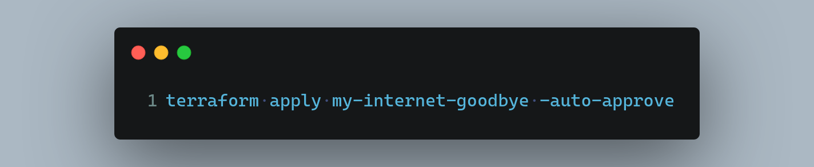
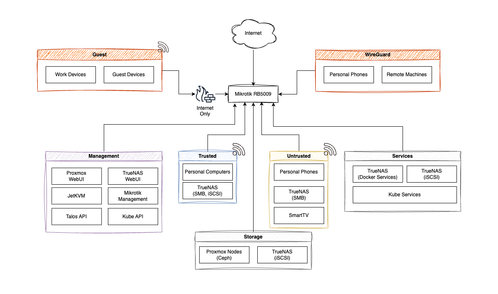

# Mikrotik - Terraform



This repository contains [Terraform](https://developer.hashicorp.com/terraform) automation for my entire Mikrotik-powered home network, applied and orchestrated via [Terragrunt](https://terragrunt.gruntwork.io/).

The purpose of this repository is to provide a structured and repeatable way to manage and automate the setup of my MikroTik devices using Infrastructure as Code (IaC) principles.

## 🤔 Why Terraform for Network Infrastructure?

Fundamentally speaking, there is nothing that sets this approach apart from, say, a configuration script or just backing up and importing the configuration on the device. Yet, I still decided to use Terraform for this. Why?

1. **I'm weird like that** 🤓
   
   As someone who works in DevOps as my main gig, manual configurations (or ClickOps, as we also call it 😉), makes me cringe and I avoid it like the plague. I like defining configuration as code whenever possible since it makes it easy to reproduce and tweak this system.

2. **Skill ~~Issue~~Development** 💪🏻

   Working on this project provides a practical, hands-on opportunity to explore advanced Terraform and Terragrunt features and patterns. Not to mention that breaking something takes my entire internet away until I fix it, and fixing it without internet may be tricker than you think. This forces me to think more carefully about the configuration before applying.

3. **Because I can** 🤷🏼

   Not everything in life has to have a good reason. Sometimes reinventing the wheel just to learn or doing things for the heck of it are valid reasons.

## 🌐 Network Overview



This project provides automated deployment and management for the following devices in my infrastructure:

- **RB5009 router** -> main router + firewall + CAPSMAN server
- **cAP AX Access Point** -> provisioned via CAPSMAN
- **CRS317 switch** -> High-performance 10G switch for server connectivity
- **CRS326 switch** -> Main Rack Switch
- **Hex switch** -> Living Room Switch (no AP functionality used here)

It also automates some external services, such as DNS records in [CloudFlare](https://www.cloudflare.com/).

I was initially planning to also add some more details about my network, like VLAN setup and wireless networks and whatnot, but then I realised I can't really be bothered to also update those whenever I change something, so if you're curious, feel free to look at the code!

## 📁 Project Structure

```bash
├── .github/                # Various repo configuration/metadata files
│   └── workflows/          # GitHub workflow configurations and automation
├── docs/img                # Network Diagram(s)
├── infrastructure/         # Terragrunt configurations
│   ├── cloudflare/         # Cloudflare DNS automation
│   │   ├── dependency.hcl  # Shared dependency configuration
│   │   ├── primary/        # Primary domain CNAME records
│   │   └── secondary/      # Secondary domain CNAME records
│   └── mikrotik/           # MikroTik device configurations
│       ├── locals.hcl      # Shared local variables (VLANs, DNS, etc.)
│       ├── provider.hcl    # Shared provider configuration
│       ├── _shared/        # Shared Terraform files
│       ├── router-base/    # RB5009 router base configuration
│       ├── router-services # Router services (DHCP, DNS, VPN, etc.)
│       ├── switch-crs317/  # CRS317 switch configuration
│       ├── switch-crs326/  # CRS326 switch configuration
│       └── switch-hex/     # Hex switch configuration
├── modules/                # Reusable Terraform modules
│   ├── cloudflare-cname/   # Cloudflare CNAME record module
│   ├── mikrotik-base/      # Base MikroTik device configuration
│   └── mikrotik-dhcp-server/ # DHCP server configuration
├── root.hcl               # Root Terragrunt configuration (remote state)
└── README.md              # This file, lol
```

## 🚀 Getting Started

### ⚙️ Requirements

- [Terraform](https://www.terraform.io/) - Infrastructure as Code tool
- [Terragrunt](https://terragrunt.gruntwork.io/) - Terraform wrapper
- [mise](https://mise.jdx.dev/) for managing dependencies
- Access to a [BackBlaze](https://www.backblaze.com/) B2 bucket for remote state storage or any other S3 compatible service

### 🔧 Initial Device Setup

Before applying any Terraform configurations, new Mikrotik devices need some minimal setup. I will not go into details here, but I did write a [blog post](https://mirceanton.com/posts/mikrotik-terraform-getting-started/) about onboarding a Mikrotik device under Terraform.

### 🌍 Environment Setup

This project uses environment variables for sensitive configuration. Set up the following environment variables:

```bash
# MikroTik device credentials
export MIKROTIK_USERNAME="your_username"
export MIKROTIK_PASSWORD="your_password"

# ISP credentials (for PPPoE)
export PPPOE_USERNAME="your_pppoe_username"
export PPPOE_PASSWORD="your_pppoe_password"

# Cloudflare API token (for DNS automation)
export CLOUDFLARE_API_TOKEN="your_cloudflare_api_token"
```

### ☁️ Remote State Configuration

This project uses BackBlaze B2 for remote state storage. The state configuration is defined in `root.hcl` and automatically manages state files for each device configuration.

To authenticate against the B2 API endpoint, you need these environment variables configured:

```bash
export AWS_ACCESS_KEY_ID="your_b2_key_id"
export AWS_SECRET_ACCESS_KEY="your_b2_application_key"
```

Previously, I was using local state files with [SOPS](https://github.com/getsops/sops) encryption to manage sensitive data in the state. While this approach worked, I ultimately decided to migrate to remote state storage to simplify the workflow by removing the encryption/decryption step, and also to stop polluting my commit history with redundant `chore: terraform apply` commits.  
This may prove to be problematic if I end up cutting my own internet access during an `apply`... but he who lives by the sword, he also dies by it 🗿

## ⚠️ Limitations

While this project aims to provide comprehensive automation for Mikrotik devices, there are some limitations:

- Initial setup still requires manual configuration before Terraform can be applied
- Complex configurations sometimes require a multi-step approach rather than a single `apply`
- The risk of cutting yourself off of the internet may be low... but it's never zero. Ask me how I know! 😉
- Prepare to get close and intimate with `terraform state mv` if you plan to rename or move objects around. Very few things are stateless, so they can't be deleted and recreated generally.

## 🤝 Sharing & Risks

By publishing this repository, I accept the risk of exposing aspects of my home network topology. While I've taken **some** steps to ensure sensitive information is managed securely, sharing this code inherently comes with certain risks.

All that being said, I ultimately decided to open-source this code and publish it for 2 main reasons:

1. I believe that sharing knowledge is valuable to the community. As I have learned from others, so shall others be able to learn from me. Such is the cycle.
2. I truly believe this was an interesting project. I hope that seeing this will inspire others to attempt similar projects and in turn also share their experiences.

## ⚖️ License

This project is licensed under the MIT License - see the [LICENSE](LICENSE) file for details.
